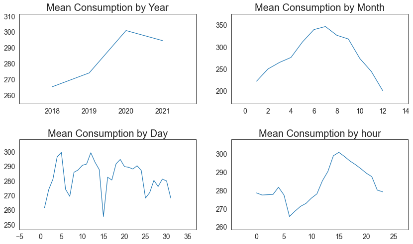
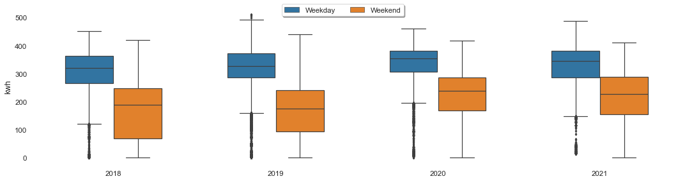
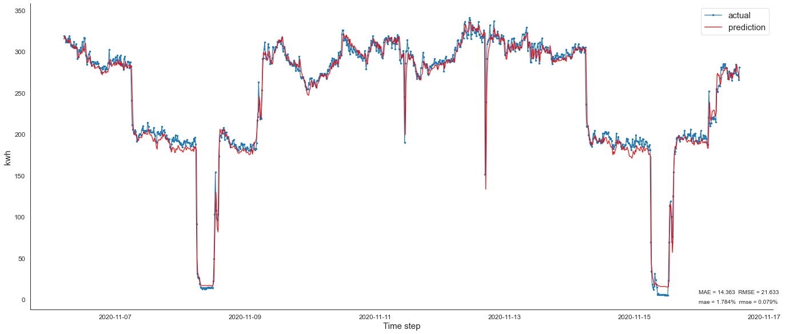

# Electricity Consumption Forecasting with LSTM

This exploratory time-series project analyzes quarter-hourly electricity consumption, forecasts future demand with a Long Short-Term Memory (LSTM) network, and investigates unusual consumption patterns using unsupervised anomaly-detection methods.

The project was an early practical introduction to time-series preprocessing, recurrent neural networks, forecasting evaluation, and outlier analysis.

## Project goals

- Explore long-term and seasonal electricity-consumption patterns
- Compare consumption across years, months, days, hours, and day types
- Build a univariate LSTM model for short-term consumption forecasting
- Compare predicted consumption with observed values
- Experiment with PCA, clustering, and Isolation Forest for outlier detection

## Data

The data contain electricity consumption measured in kilowatt-hours (`kWh`) at 15-minute intervals. The available observations span multiple years from 2018 to 2021.

Preprocessing in the notebooks includes:

- Timestamp parsing and chronological ordering
- Duplicate removal
- Selection of a single value for duplicated timestamps
- Missing-value inspection and time-series preparation
- Min-max normalization for LSTM training
- Chronological 80/20 train-test splitting
- Sliding-window sequence creation

The source data are not included in this repository. To reproduce the notebooks, update the local dataset paths and provide data with compatible timestamp and consumption columns.

## Exploratory data analysis

Average consumption was examined across several temporal resolutions. The plots suggest increasing annual mean consumption through 2020 followed by a small decline in 2021, higher average consumption during summer months, and a daily peak around the afternoon. These patterns are descriptive and may be specific to the analyzed consumer.

Weekday consumption was consistently higher than weekend consumption in the yearly comparison, indicating that day type may be useful for future multivariate forecasting models.

## LSTM forecasting model

The main forecasting notebook uses a univariate LSTM model trained only on past electricity-consumption values.

### Sequence preparation

- Sampling interval: 15 minutes
- Look-back window: 96 observations
- Historical context: 24 hours
- Forecast target: next consumption value
- Scaling: MinMaxScaler with range `[0, 1]`

### Architecture and training

The network contains four stacked LSTM layers followed by a single-value dense output:

| Layer | Units | Additional setting |
| --- | ---: | --- |
| LSTM | 100 | Returns sequences |
| LSTM | 50 | Returns sequences |
| LSTM | 50 | Returns sequences |
| LSTM | 50 | Final recurrent output |
| Dense | 1 | Consumption forecast |

Training settings:

- Optimizer: Adam
- Loss: Mean squared error
- Batch size: 20
- Maximum epochs: 50
- Dropout: 0.2 between LSTM layers in the evaluated model
- Early stopping patience: 25 epochs
- Shuffling disabled to preserve sequence order

## Forecasting results

The predicted series follows most short-term changes in the observed consumption and captures the major operating-level transitions. The displayed evaluation produced approximately:

- **MAE:** 14.36 kWh
- **RMSE:** 21.68 kWh

Performance is weaker around sudden drops and sharp recoveries, which may represent shutdowns, operational changes, missing-data effects, or anomalous events.

## Experimental outlier detection

A separate notebook explores unsupervised approaches for detecting unusual consumption observations:

1. **Principal Component Analysis (PCA)** reduces the dimensionality of the consumption features.
2. **K-means clustering** groups observations in the reduced feature space.
3. Large distances from the nearest cluster centroid are treated as possible anomalies.
4. **Isolation Forest** provides a second anomaly score using an assumed contamination rate of 1%.

The notebook compares the anomaly labels produced by clustering distance and Isolation Forest. These detections should be interpreted as candidate outliers rather than confirmed faults because no independently validated anomaly labels are available in the notebook.

## Repository contents

- `univariate_lstm_forecast_final.ipynb` - data preparation, LSTM training, evaluation, and forecasting
- `Outlier_isolationforest_clustering.ipynb` - PCA, K-means, and Isolation Forest experiments
- `images/` - EDA and forecasting figures displayed in this README
- `README.md` - project documentation

## Main dependencies

- Python
- NumPy
- pandas
- TensorFlow / Keras
- scikit-learn
- Matplotlib
- Seaborn
- Plotly
- statsmodels

## How to run

1. Open the notebooks in Jupyter Notebook or Google Colab.
2. Install the required dependencies.
3. Replace the original local CSV paths with the location of your own dataset.
4. Run the preprocessing and EDA cells in order.
5. Train and evaluate the LSTM forecasting model.
6. Run the anomaly-detection notebook separately to explore candidate outliers.

## Limitations

- The LSTM uses only historical consumption and does not include weather, holidays, calendar variables, or operational context.
- The test set is also used as validation data during training, so a separate validation split would provide a cleaner final evaluation.
- Sudden changes are smoothed or tracked with a delay.
- Results are based on one consumption series and may not generalize to other consumers.
- The anomaly-detection contamination rate is assumed rather than derived from verified labels.
- The notebooks contain machine-specific file paths that must be updated before reuse.

## Possible improvements

- Use separate training, validation, and test periods
- Add calendar, holiday, and weather features
- Compare LSTM performance with naive, seasonal, XGBoost, and statistical baselines
- Perform true recursive multi-step forecasting for day-ahead prediction
- Tune sequence length, network size, dropout, and learning rate
- Validate detected anomalies against known events
- Package preprocessing and evaluation into reusable functions

## Note

This is an exploratory educational project and not a production energy-management or anomaly-alerting system.
